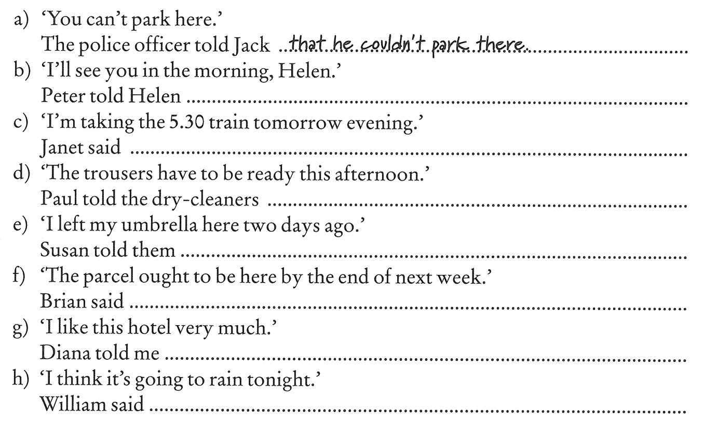

Fire

Flame

ignite 
set fire - podpalić

extinguish - zgasić
put out fires - radzić sobie z ogniem

flames

ring of fire

faint-hearted (adj) - bojaźliwy

1. 24
2. 1000
3. 20 20
4. 10
5. 14

He said tehy offten had to do 24-shift
He said He had been a ... for 10 years
He said Hee typialy did 14-day

Peter tolt me he would see her in the morning that day

Janet said that she was taking the train at 5.30 the following day.

... that the trousers had to be ready that aftrennon

... 