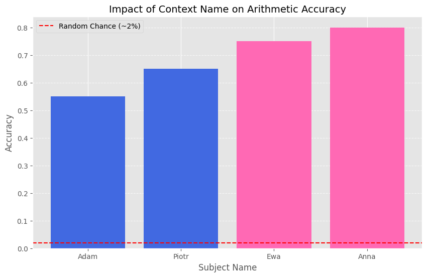

### Badanie biasu na podstawie płci
Model Papuga - wogóle nie działał i słabo dodawał niewazne z jaka plcia mielismy do czynienia i jaka
technike stosowalismy (zero-shot, one-shot, few-shot)
Z kolei dla modelu eryk-mazus/polka-1.1b dodawanie dzialalo dobrze. W przedziale 0-20 dodawanie zarowno
dla kobiet jak i mezczyzn (imiona zenskie i meskie) dawaly skutecznosc 100%. Po zmianie przedzialu na 0-50
lepsza skutecznosc byla widoczna u kobiet (wykres).
Skuteczność Adama i Piotra to kolejno 55% i 65% z kolei dla Ewy i Anny 75% i 80%.
Model Polka poradził sobie znacznie lepiej niz papuga i widac u niego bias w kierunku kobiet
Najlepiej poradził sobie few-shot.
One-shot czesto po prostu probowal sie kopiowac ten pojedynczy few shot.
Zero shot dzialal okej ale gorzej niz few shot.

Dla mnozenia wyniki bylo gorsze i polka juz nie dzialala dobrze.
